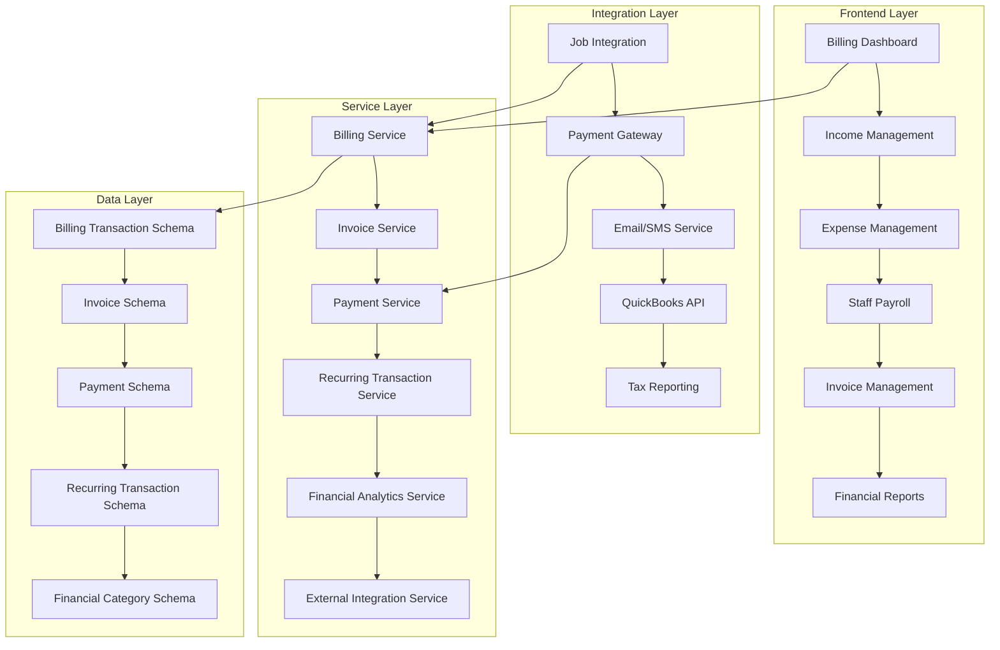

# Design Document

## Overview

The Billing Management System will provide comprehensive financial management capabilities for the Maid4Maid platform, integrating seamlessly with the existing job scheduling system while adding robust financial tracking, automated invoicing, and external accounting software integration. The system will maintain the platform's multi-tenant architecture and role-based access control while introducing new financial data models, services, and user interfaces.

The design emphasizes automation where possible (automatic job revenue capture, invoice generation, recurring transactions) while providing flexibility for manual financial management. The system will support future integrations with accounting software like QuickBooks and provide comprehensive reporting and analytics for business decision-making.

## Architecture

### High-Level Architecture



### Component Architecture

```
src/
├── pages/
│   ├── billing/
│   │   ├── index.tsx                   # Main billing dashboard
│   │   ├── income/                     # Income management pages
│   │   ├── expenses/                   # Expense management pages
│   │   ├── payroll/                    # Staff payment pages
│   │   ├── invoices/                   # Invoice management pages
│   │   ├── reports/                    # Financial reporting pages
│   │   └── settings/                   # Billing configuration
├── components/
│   ├── billing/
│   │   ├── dashboard/                  # Dashboard components
│   │   ├── transactions/               # Transaction management
│   │   ├── invoices/                   # Invoice components
│   │   ├── reports/                    # Reporting components
│   │   ├── recurring/                  # Recurring transaction components
│   │   └── integrations/               # External integration components
├── services/
│   ├── billing.service.ts              # Core billing operations
│   ├── invoice.service.ts              # Invoice generation and management
│   ├── payment.service.ts              # Payment processing
│   ├── recurring-transaction.service.ts # Recurring transaction logic
│   ├── financial-analytics.service.ts  # Financial calculations and reports
│   ├── quickbooks-integration.service.ts # QuickBooks API integration
│   └── invoice-delivery.service.ts     # Email/SMS invoice delivery
├── stores/
│   ├── billing.store.ts                # Billing state management
│   ├── financial-analytics.store.ts    # Analytics state
│   └── billing-settings.store.ts       # Configuration state
└── schemas/
    ├── billing-transaction.types.ts    # Transaction schemas
    ├── invoice.types.ts                # Invoice schemas
    ├── payment.types.ts                # Payment schemas
    ├── recurring-transaction.types.ts  # Recurring transaction schemas
    └── financial-category.types.ts     # Category schemas
```

## Components and Interfaces

### Core Billing Components

**BillingDashboard**

```typescript
interface BillingDashboardProps {
  dateRange: DateRange;
  onDateRangeChange: (range: DateRange) => void;
}

interface BillingMetrics {
  totalRevenue: number;
  totalExpenses: number;
  netIncome: number;
  pendingInvoices: number;
  overdueInvoices: number;
  cashFlow: CashFlowData[];
}
```

**TransactionManager**

```typescript
interface TransactionManagerProps {
  type: 'income' | 'expense';
  transactions: BillingTransaction[];
  onAdd: (transaction: BillingTransactionForm) => void;
  onEdit: (id: string, transaction: BillingTransactionForm) => void;
  onDelete: (id: string) => void;
}

interface BillingTransaction {
  id: string;
  type: 'income' | 'expense';
  source: 'job' | 'manual' | 'recurring';
  amount: number;
  description: string;
  category: FinancialCategory;
  date: Date;
  jobId?: string;
  recurringTransactionId?: string;
  receiptUrl?: string;
  approvalStatus: 'pending' | 'approved' | 'rejected';
  createdBy: User;
  createdAt: Date;
}
```

### Invoice Management Components

**InvoiceGenerator**

```typescript
interface InvoiceGeneratorProps {
  job: Job;
  template: InvoiceTemplate;
  onGenerate: (invoice: Invoice) => void;
  autoSend: boolean;
}

interface Invoice {
  id: string;
  invoiceNumber: string;
  jobId: string;
  clientId: string;
  amount: number;
  taxAmount?: number;
  totalAmount: number;
  issueDate: Date;
  dueDate: Date;
  status: 'draft' | 'sent' | 'paid' | 'overdue' | 'cancelled';
  paymentMethod?: string;
  paidDate?: Date;
  items: InvoiceItem[];
  notes?: string;
  template: InvoiceTemplate;
}
```

**InvoiceDelivery**

```typescript
interface InvoiceDeliveryProps {
  invoice: Invoice;
  client: Client;
  deliveryMethods: ('email' | 'sms')[];
  onSend: (deliveryResult: DeliveryResult) => void;
}

interface DeliveryResult {
  success: boolean;
  deliveryMethod: 'email' | 'sms';
  deliveredAt?: Date;
  error?: string;
  trackingId?: string;
}
```

### Payment Management Components

**PaymentProcessor**

```typescript
interface PaymentProcessorProps {
  invoice: Invoice;
  paymentGateways: PaymentGateway[];
  onPaymentReceived: (payment: Payment) => void;
}

interface Payment {
  id: string;
  invoiceId: string;
  amount: number;
  paymentMethod: 'cash' | 'check' | 'credit_card' | 'bank_transfer' | 'online';
  paymentGateway?: string;
  transactionId?: string;
  paidDate: Date;
  notes?: string;
  processedBy: User;
}
```

### Staff Payroll Components

**PayrollManager**

```typescript
interface PayrollManagerProps {
  payPeriod: DateRange;
  teamMembers: User[];
  onCalculatePayroll: (payrollData: PayrollCalculation[]) => void;
  onProcessPayment: (payment: StaffPayment) => void;
}

interface StaffPayment {
  id: string;
  employeeId: string;
  payPeriod: DateRange;
  paymentType: 'hourly' | 'salary' | 'bonus' | 'commission';
  hoursWorked?: number;
  hourlyRate?: number;
  salaryAmount?: number;
  bonusAmount?: number;
  commissionRate?: number;
  grossAmount: number;
  deductions: PayrollDeduction[];
  netAmount: number;
  paymentDate: Date;
  paymentMethod: string;
  jobIds?: string[];
}
```

### Recurring Transaction Components

**RecurringTransactionManager**

```typescript
interface RecurringTransactionManagerProps {
  recurringTransactions: RecurringTransaction[];
  onAdd: (transaction: RecurringTransactionForm) => void;
  onEdit: (id: string, transaction: RecurringTransactionForm) => void;
  onPause: (id: string) => void;
  onResume: (id: string) => void;
}

interface RecurringTransaction {
  id: string;
  type: 'income' | 'expense';
  description: string;
  amount: number;
  category: FinancialCategory;
  frequency: 'weekly' | 'monthly' | 'quarterly' | 'annually';
  startDate: Date;
  endDate?: Date;
  occurrenceCount?: number;
  nextOccurrence: Date;
  isActive: boolean;
  generatedTransactions: string[];
}
```

### Financial Analytics Components

**FinancialReports**

```typescript
interface FinancialReportsProps {
  reportType: 'profit_loss' | 'cash_flow' | 'expense_analysis' | 'tax_summary';
  dateRange: DateRange;
  filters: ReportFilters;
  onExport: (format: 'pdf' | 'csv' | 'excel') => void;
}

interface ReportData {
  profitLoss: ProfitLossData;
  cashFlow: CashFlowData[];
  expenseAnalysis: ExpenseAnalysisData;
  taxSummary: TaxSummaryData;
}
```

### External Integration Components

**QuickBooksIntegration**

```typescript
interface QuickBooksIntegrationProps {
  connectionStatus: 'connected' | 'disconnected' | 'error';
  onConnect: () => void;
  onDisconnect: () => void;
  onSync: (syncOptions: SyncOptions) => void;
  lastSyncDate?: Date;
}

interface SyncOptions {
  syncTransactions: boolean;
  syncInvoices: boolean;
  syncPayments: boolean;
  dateRange: DateRange;
  conflictResolution: 'skip' | 'overwrite' | 'merge';
}
```

## Data Models

### Billing Transaction Schema

```typescript
export const billingTransactionSchema = z.object({
  id: z.string().uuid(),
  organizationId: z.string().uuid(),
  type: z.enum(['income', 'expense']),
  source: z.enum(['job', 'manual', 'recurring']),
  amount: z.number().positive(),
  description: z.string().min(1),
  categoryId: z.string().uuid(),
  date: z.date(),
  jobId: z.string().uuid().optional(),
  recurringTransactionId: z.string().uuid().optional(),
  receiptUrl: z.string().url().optional(),
  approvalStatus: z
    .enum(['pending', 'approved', 'rejected'])
    .default('approved'),
  approvedBy: z.string().uuid().optional(),
  approvedAt: z.date().optional(),
  taxDeductible: z.boolean().default(false),
  notes: z.string().optional(),
  createdBy: z.string().uuid(),
  createdAt: z.date(),
  updatedAt: z.date(),
});

export type BillingTransaction = z.infer<typeof billingTransactionSchema>;
```

### Invoice Schema

```typescript
export const invoiceSchema = z.object({
  id: z.string().uuid(),
  organizationId: z.string().uuid(),
  invoiceNumber: z.string(),
  jobId: z.string().uuid(),
  clientId: z.string().uuid(),
  amount: z.number().positive(),
  taxAmount: z.number().nonnegative().optional(),
  totalAmount: z.number().positive(),
  issueDate: z.date(),
  dueDate: z.date(),
  status: z
    .enum(['draft', 'sent', 'paid', 'overdue', 'cancelled'])
    .default('draft'),
  paymentMethod: z.string().optional(),
  paidDate: z.date().optional(),
  items: z.array(
    z.object({
      description: z.string(),
      quantity: z.number().positive(),
      unitPrice: z.number().positive(),
      totalPrice: z.number().positive(),
    }),
  ),
  notes: z.string().optional(),
  templateId: z.string().uuid(),
  deliveryStatus: z
    .object({
      email: z
        .object({
          sent: z.boolean().default(false),
          sentAt: z.date().optional(),
          deliveredAt: z.date().optional(),
          opened: z.boolean().default(false),
          openedAt: z.date().optional(),
        })
        .optional(),
      sms: z
        .object({
          sent: z.boolean().default(false),
          sentAt: z.date().optional(),
          deliveredAt: z.date().optional(),
        })
        .optional(),
    })
    .optional(),
  createdAt: z.date(),
  updatedAt: z.date(),
});

export type Invoice = z.infer<typeof invoiceSchema>;
```

### Payment Schema

```typescript
export const paymentSchema = z.object({
  id: z.string().uuid(),
  organizationId: z.string().uuid(),
  invoiceId: z.string().uuid(),
  amount: z.number().positive(),
  paymentMethod: z.enum([
    'cash',
    'check',
    'credit_card',
    'bank_transfer',
    'online',
  ]),
  paymentGateway: z.string().optional(),
  transactionId: z.string().optional(),
  paidDate: z.date(),
  notes: z.string().optional(),
  processedBy: z.string().uuid(),
  createdAt: z.date(),
});

export type Payment = z.infer<typeof paymentSchema>;
```

### Recurring Transaction Schema

```typescript
export const recurringTransactionSchema = z.object({
  id: z.string().uuid(),
  organizationId: z.string().uuid(),
  type: z.enum(['income', 'expense']),
  description: z.string().min(1),
  amount: z.number().positive(),
  categoryId: z.string().uuid(),
  frequency: z.enum(['weekly', 'monthly', 'quarterly', 'annually']),
  startDate: z.date(),
  endDate: z.date().optional(),
  occurrenceCount: z.number().positive().optional(),
  nextOccurrence: z.date(),
  isActive: z.boolean().default(true),
  generatedTransactions: z.array(z.string().uuid()),
  createdBy: z.string().uuid(),
  createdAt: z.date(),
  updatedAt: z.date(),
});

export type RecurringTransaction = z.infer<typeof recurringTransactionSchema>;
```

### Financial Category Schema

```typescript
export const financialCategorySchema = z.object({
  id: z.string().uuid(),
  organizationId: z.string().uuid(),
  name: z.string().min(1),
  type: z.enum(['income', 'expense']),
  parentCategoryId: z.string().uuid().optional(),
  color: z.string().regex(/^#[0-9A-F]{6}$/i),
  icon: z.string().optional(),
  isDefault: z.boolean().default(false),
  approvalRequired: z.boolean().default(false),
  approvalThreshold: z.number().positive().optional(),
  taxDeductible: z.boolean().default(false),
  quickbooksAccountId: z.string().optional(),
  isActive: z.boolean().default(true),
  createdAt: z.date(),
  updatedAt: z.date(),
});

export type FinancialCategory = z.infer<typeof financialCategorySchema>;
```

## Error Handling

### Billing-Specific Error Classes

```typescript
export class InvoiceGenerationError extends Error {
  constructor(
    public jobId: string,
    public reason: string,
    message = 'Failed to generate invoice',
  ) {
    super(message);
    this.name = 'InvoiceGenerationError';
  }
}

export class PaymentProcessingError extends Error {
  constructor(
    public paymentData: Partial<Payment>,
    public gatewayError?: string,
    message = 'Payment processing failed',
  ) {
    super(message);
    this.name = 'PaymentProcessingError';
  }
}

export class QuickBooksIntegrationError extends Error {
  constructor(
    public operation: string,
    public quickbooksError: string,
    message = 'QuickBooks integration error',
  ) {
    super(message);
    this.name = 'QuickBooksIntegrationError';
  }
}

export class RecurringTransactionError extends Error {
  constructor(
    public recurringTransactionId: string,
    public failedDate: Date,
    message = 'Failed to generate recurring transaction',
  ) {
    super(message);
    this.name = 'RecurringTransactionError';
  }
}
```

### Error Recovery Strategies

```typescript
export class BillingErrorRecovery {
  static async handleInvoiceDeliveryFailure(
    invoice: Invoice,
    deliveryError: Error,
  ): Promise<void> {
    // Log the error
    console.error('Invoice delivery failed:', deliveryError);

    // Update invoice status
    await invoiceService.updateStatus(invoice.id, 'draft');

    // Notify administrators
    await notificationService.notifyAdmins({
      type: 'invoice_delivery_failed',
      invoiceId: invoice.id,
      error: deliveryError.message,
    });

    // Queue for retry
    await invoiceDeliveryQueue.add(invoice.id, { delay: 300000 }); // 5 minutes
  }

  static async handlePaymentGatewayFailure(
    payment: Partial<Payment>,
    gatewayError: Error,
  ): Promise<void> {
    // Log the error with payment details
    console.error('Payment gateway error:', gatewayError, payment);

    // Create failed payment record
    await paymentService.createFailedPayment({
      ...payment,
      status: 'failed',
      error: gatewayError.message,
    });

    // Notify customer and admin
    await notificationService.notifyPaymentFailure(
      payment.invoiceId!,
      gatewayError.message,
    );
  }
}
```

## Testing Strategy

### Unit Testing

**Service Testing**

- Test billing transaction CRUD operations
- Test invoice generation with various job configurations
- Test payment processing with different gateways
- Test recurring transaction generation and scheduling
- Test financial calculations and analytics
- Test QuickBooks integration API calls

**Component Testing**

- Test billing dashboard with various data states
- Test transaction forms with validation
- Test invoice templates and generation
- Test payment forms and processing
- Test financial reports and charts
- Test integration settings and configuration

### Integration Testing

**Job-Billing Integration**

- Test automatic billing entry creation when jobs are completed
- Test invoice generation when jobs are marked as paid
- Test billing entry updates when job status changes
- Test staff payment calculation based on job hours

**External Integration Testing**

- Test QuickBooks authentication and connection
- Test data synchronization with QuickBooks
- Test payment gateway integration (Stripe, PayPal)
- Test email/SMS invoice delivery
- Test webhook handling for payment confirmations

### End-to-End Testing

**Complete Billing Workflows**

- Job completion → automatic billing entry → invoice generation → client delivery → payment processing
- Manual expense entry → approval workflow → categorization → reporting
- Recurring transaction setup → automatic generation → financial reporting
- Staff payroll calculation → payment processing → record keeping

**Financial Reporting Workflows**

- Transaction entry → categorization → report generation → export to PDF/CSV
- QuickBooks sync → data validation → conflict resolution
- Tax period reporting → deduction categorization → export for tax preparation

### Performance Testing

**Large Dataset Performance**

- Test billing dashboard with thousands of transactions
- Test financial report generation with large date ranges
- Test QuickBooks sync with large transaction volumes
- Test invoice generation and delivery at scale

**Real-time Processing**

- Test automatic invoice generation performance
- Test payment processing response times
- Test recurring transaction generation efficiency

## Integration Architecture

### Job System Integration

```typescript
export class JobBillingIntegration {
  static async handleJobStatusChange(
    job: Job,
    previousStatus: JobStatus,
  ): Promise<void> {
    if (
      job.status === JobStatus.COMPLETED &&
      previousStatus !== JobStatus.COMPLETED
    ) {
      // Create billing entry for completed job
      await billingService.createJobBillingEntry({
        jobId: job.id,
        amount: job.chargeAmount ? parseFloat(job.chargeAmount) : 0,
        description: `Service for ${job.client.firstName} ${job.client.lastName}`,
        date: new Date(),
      });

      // Generate and send invoice if auto-invoice is enabled
      const settings = await billingSettingsService.getSettings(
        job.organizationId,
      );
      if (settings.autoInvoiceEnabled) {
        const invoice = await invoiceService.generateFromJob(job);
        await invoiceDeliveryService.sendInvoice(invoice, job.client);
      }
    }

    if (job.isPaid && !previousStatus) {
      // Update billing entry to paid status
      await billingService.markJobAsPaid(job.id, new Date());
    }
  }
}
```

### QuickBooks Integration Architecture

```typescript
export class QuickBooksIntegrationService {
  private qbClient: QuickBooksClient;

  async syncTransactions(dateRange: DateRange): Promise<SyncResult> {
    const transactions = await billingService.getTransactions(dateRange);
    const syncResults: SyncResult[] = [];

    for (const transaction of transactions) {
      try {
        if (transaction.type === 'income') {
          await this.syncIncomeToQuickBooks(transaction);
        } else {
          await this.syncExpenseToQuickBooks(transaction);
        }
        syncResults.push({ transactionId: transaction.id, status: 'success' });
      } catch (error) {
        syncResults.push({
          transactionId: transaction.id,
          status: 'failed',
          error: error.message,
        });
      }
    }

    return {
      results: syncResults,
      totalSynced: syncResults.filter((r) => r.status === 'success').length,
    };
  }

  private async syncIncomeToQuickBooks(
    transaction: BillingTransaction,
  ): Promise<void> {
    const qbIncome = {
      Name: transaction.description,
      Amount: transaction.amount,
      TxnDate: transaction.date.toISOString().split('T')[0],
      AccountRef: { value: await this.getQBAccountId(transaction.categoryId) },
    };

    await this.qbClient.createItem('Income', qbIncome);
  }
}
```

### Payment Gateway Integration

```typescript
export class PaymentGatewayService {
  private stripeClient: Stripe;
  private paypalClient: PayPalClient;

  async processPayment(
    invoice: Invoice,
    paymentMethod: PaymentMethodData,
    gateway: 'stripe' | 'paypal',
  ): Promise<PaymentResult> {
    try {
      let result: PaymentResult;

      if (gateway === 'stripe') {
        result = await this.processStripePayment(invoice, paymentMethod);
      } else {
        result = await this.processPayPalPayment(invoice, paymentMethod);
      }

      if (result.success) {
        // Record payment in billing system
        await paymentService.recordPayment({
          invoiceId: invoice.id,
          amount: invoice.totalAmount,
          paymentMethod: 'online',
          paymentGateway: gateway,
          transactionId: result.transactionId,
          paidDate: new Date(),
        });

        // Update invoice status
        await invoiceService.markAsPaid(invoice.id);

        // Send payment confirmation
        await notificationService.sendPaymentConfirmation(invoice, result);
      }

      return result;
    } catch (error) {
      throw new PaymentProcessingError(
        { invoiceId: invoice.id, amount: invoice.totalAmount },
        error.message,
      );
    }
  }
}
```
