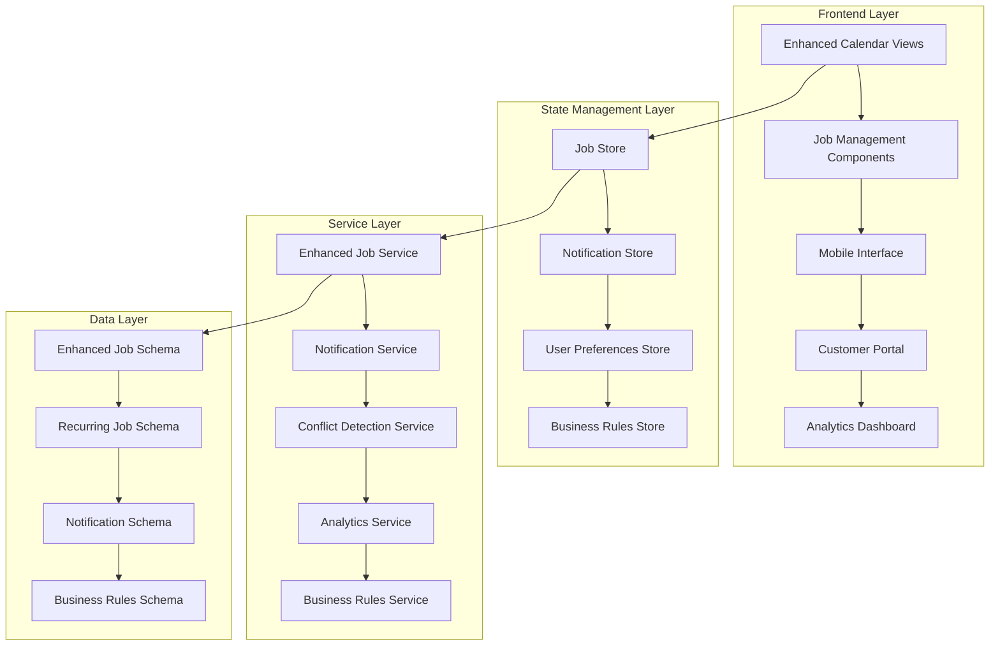

# Design Document

## Overview

The Enhanced Job Scheduling System will extend the existing Maid4Maid scheduling functionality to provide a comprehensive solution for managing cleaning service appointments. The design builds upon the current React/TypeScript architecture, leveraging existing components like JobCalendar, JobFormSheet, and JobViewModal while adding new capabilities for recurring jobs, conflict detection, bulk operations, notifications, mobile optimization, analytics, customer portal, and business rules configuration.

The system will maintain the current multi-tenant, role-based architecture while introducing new services, components, and data models to support advanced scheduling features. The design emphasizes maintainability, scalability, and user experience consistency across desktop and mobile platforms.

## Architecture

### High-Level Architecture



### Component Architecture

The system will extend the existing component structure:

```
src/
├── components/
│   ├── scheduling/
│   │   ├── enhanced-calendar/          # Enhanced calendar components
│   │   ├── recurring-jobs/             # Recurring job management
│   │   ├── bulk-operations/            # Multi-select and bulk actions
│   │   ├── conflict-detection/         # Conflict warning components
│   │   └── mobile-interface/           # Mobile-optimized components
│   ├── notifications/                  # Notification components
│   ├── analytics/                      # Dashboard and reporting
│   ├── customer-portal/                # Client-facing components
│   └── business-rules/                 # Admin configuration
├── services/
│   ├── enhanced-job.service.ts         # Extended job operations
│   ├── recurring-job.service.ts        # Recurring job logic
│   ├── notification.service.ts         # Email/SMS notifications
│   ├── conflict-detection.service.ts   # Scheduling conflict logic
│   ├── analytics.service.ts            # Reporting and metrics
│   └── business-rules.service.ts       # Configuration management
├── stores/
│   ├── job-scheduling.store.ts         # Enhanced job state
│   ├── notification.store.ts           # Notification state
│   ├── user-preferences.store.ts       # User settings
│   └── business-rules.store.ts         # Configuration state
└── schemas/
    ├── recurring-job.types.ts          # Recurring job definitions
    ├── notification.types.ts           # Notification schemas
    ├── analytics.types.ts              # Reporting schemas
    └── business-rules.types.ts         # Configuration schemas
```

## Components and Interfaces

### Enhanced Calendar Components

**RecurringJobManager**

```typescript
interface RecurringJobManagerProps {
  job?: Job;
  onSave: (recurringPattern: RecurringPattern) => void;
  onCancel: () => void;
}

interface RecurringPattern {
  frequency: 'daily' | 'weekly' | 'biweekly' | 'monthly' | 'custom';
  interval: number;
  daysOfWeek?: number[];
  endDate?: Date;
  occurrenceCount?: number;
}
```

**ConflictDetectionProvider**

```typescript
interface ConflictDetectionContextType {
  checkConflicts: (job: JobForm) => Promise<Conflict[]>;
  resolveConflict: (conflict: Conflict, resolution: ConflictResolution) => void;
  conflicts: Conflict[];
}

interface Conflict {
  id: string;
  type: 'team_unavailable' | 'client_double_booking' | 'resource_conflict';
  message: string;
  suggestedResolutions: ConflictResolution[];
}
```

**BulkOperationsToolbar**

```typescript
interface BulkOperationsToolbarProps {
  selectedJobs: Job[];
  onBulkReschedule: (offset: TimeOffset) => void;
  onBulkStatusUpdate: (status: JobStatus) => void;
  onBulkDelete: () => void;
  onClearSelection: () => void;
}

interface TimeOffset {
  days?: number;
  hours?: number;
  minutes?: number;
}
```

### Mobile Interface Components

**MobileJobCard**

```typescript
interface MobileJobCardProps {
  job: Job;
  onStatusUpdate: (status: JobStatus, notes?: string) => void;
  onAddPhoto: (photo: File) => void;
  showQuickActions: boolean;
}
```

**MobileStatusUpdater**

```typescript
interface MobileStatusUpdaterProps {
  job: Job;
  onUpdate: (update: JobStatusUpdate) => void;
  offlineMode: boolean;
}

interface JobStatusUpdate {
  status: JobStatus;
  notes?: string;
  photos?: File[];
  timestamp: Date;
  location?: GeolocationCoordinates;
}
```

### Notification Components

**NotificationCenter**

```typescript
interface NotificationCenterProps {
  notifications: Notification[];
  onMarkAsRead: (id: string) => void;
  onMarkAllAsRead: () => void;
  onDeleteNotification: (id: string) => void;
}

interface Notification {
  id: string;
  type: 'job_assigned' | 'job_rescheduled' | 'job_cancelled' | 'job_reminder';
  title: string;
  message: string;
  timestamp: Date;
  read: boolean;
  actionUrl?: string;
}
```

### Analytics Components

**AnalyticsDashboard**

```typescript
interface AnalyticsDashboardProps {
  dateRange: DateRange;
  onDateRangeChange: (range: DateRange) => void;
  teamFilter?: Team;
  onTeamFilterChange: (team: Team | null) => void;
}

interface AnalyticsMetrics {
  jobsCompleted: number;
  revenue: number;
  teamUtilization: number;
  clientSatisfaction: number;
  averageJobDuration: number;
  completionRate: number;
}
```

### Customer Portal Components

**CustomerAppointmentList**

```typescript
interface CustomerAppointmentListProps {
  clientId: string;
  appointments: Job[];
  onRescheduleRequest: (jobId: string, preferredDate: Date) => void;
  onCancelRequest: (jobId: string, reason: string) => void;
  onRateService: (jobId: string, rating: number, feedback: string) => void;
}
```

## Data Models

### Enhanced Job Schema

```typescript
// Extend existing job schema
export const enhancedJobSchema = jobSchema.extend({
  recurringJobId: z.string().uuid().optional(),
  isRecurring: z.boolean().default(false),
  conflictStatus: z.enum(['none', 'warning', 'blocked']).default('none'),
  completionNotes: z.string().optional(),
  completionPhotos: z.array(z.string()).optional(),
  customerRating: z.number().min(1).max(5).optional(),
  customerFeedback: z.string().optional(),
  gpsLocation: z
    .object({
      latitude: z.number(),
      longitude: z.number(),
      timestamp: z.date(),
    })
    .optional(),
});
```

### Recurring Job Schema

```typescript
export const recurringJobSchema = z.object({
  id: z.string().uuid(),
  templateJobId: z.string().uuid(),
  frequency: z.enum(['daily', 'weekly', 'biweekly', 'monthly', 'custom']),
  interval: z.number().min(1),
  daysOfWeek: z.array(z.number().min(0).max(6)).optional(),
  endDate: z.date().optional(),
  occurrenceCount: z.number().optional(),
  isActive: z.boolean().default(true),
  createdAt: z.date(),
  updatedAt: z.date(),
  nextOccurrence: z.date(),
  generatedJobs: z.array(z.string().uuid()),
});

export type RecurringJob = z.infer<typeof recurringJobSchema>;
```

### Notification Schema

```typescript
export const notificationSchema = z.object({
  id: z.string().uuid(),
  userId: z.string().uuid(),
  type: z.enum([
    'job_assigned',
    'job_rescheduled',
    'job_cancelled',
    'job_reminder',
    'system_alert',
  ]),
  title: z.string(),
  message: z.string(),
  data: z.record(z.any()).optional(),
  read: z.boolean().default(false),
  emailSent: z.boolean().default(false),
  smsSent: z.boolean().default(false),
  createdAt: z.date(),
  readAt: z.date().optional(),
});

export type Notification = z.infer<typeof notificationSchema>;
```

### Business Rules Schema

```typescript
export const businessRulesSchema = z.object({
  id: z.string().uuid(),
  organizationId: z.string().uuid(),
  workingHours: z.object({
    monday: z.object({ start: z.string(), end: z.string() }).optional(),
    tuesday: z.object({ start: z.string(), end: z.string() }).optional(),
    wednesday: z.object({ start: z.string(), end: z.string() }).optional(),
    thursday: z.object({ start: z.string(), end: z.string() }).optional(),
    friday: z.object({ start: z.string(), end: z.string() }).optional(),
    saturday: z.object({ start: z.string(), end: z.string() }).optional(),
    sunday: z.object({ start: z.string(), end: z.string() }).optional(),
  }),
  teamConstraints: z.object({
    maxJobsPerDay: z.number().min(1),
    minTimeBetweenJobs: z.number().min(0), // minutes
    maxTravelDistance: z.number().min(0), // miles
  }),
  clientRules: z.object({
    minNoticeHours: z.number().min(0),
    maxJobsPerDay: z.number().min(1),
    allowSameDayBooking: z.boolean(),
  }),
  holidays: z.array(z.date()),
  updatedAt: z.date(),
});

export type BusinessRules = z.infer<typeof businessRulesSchema>;
```

## Error Handling

### Conflict Detection Error Handling

```typescript
export class ConflictDetectionError extends Error {
  constructor(
    public conflicts: Conflict[],
    message = 'Scheduling conflicts detected',
  ) {
    super(message);
    this.name = 'ConflictDetectionError';
  }
}

export class RecurringJobError extends Error {
  constructor(
    public failedOccurrences: Date[],
    message = 'Failed to create some recurring job occurrences',
  ) {
    super(message);
    this.name = 'RecurringJobError';
  }
}
```

### Offline Handling for Mobile

```typescript
export class OfflineJobUpdateQueue {
  private queue: JobStatusUpdate[] = [];

  async queueUpdate(update: JobStatusUpdate): Promise<void> {
    this.queue.push(update);
    await this.persistQueue();
  }

  async syncWhenOnline(): Promise<void> {
    if (navigator.onLine && this.queue.length > 0) {
      const updates = [...this.queue];
      this.queue = [];

      for (const update of updates) {
        try {
          await jobService.updateStatus(update);
        } catch (error) {
          // Re-queue failed updates
          this.queue.push(update);
        }
      }

      await this.persistQueue();
    }
  }
}
```

## Testing Strategy

### Unit Testing

**Component Testing**

- Test recurring job pattern generation
- Test conflict detection logic
- Test bulk operation state management
- Test mobile interface responsiveness
- Test notification rendering and interactions

**Service Testing**

- Test job scheduling with conflicts
- Test recurring job creation and management
- Test notification delivery mechanisms
- Test analytics calculation accuracy
- Test business rules validation

### Integration Testing

**Calendar Integration**

- Test job creation with recurring patterns
- Test conflict detection during scheduling
- Test bulk operations across multiple jobs
- Test real-time updates across calendar views

**Mobile Interface Integration**

- Test offline job status updates
- Test photo upload functionality
- Test GPS location capture
- Test sync when coming back online

**Notification Integration**

- Test email notification delivery
- Test in-app notification display
- Test notification preferences handling
- Test notification history management

### End-to-End Testing

**Complete Scheduling Workflows**

- Create recurring job → verify all occurrences generated
- Schedule conflicting job → verify conflict detection and resolution
- Bulk reschedule jobs → verify all jobs updated correctly
- Mobile status update → verify sync to desktop calendar

**Customer Portal Workflows**

- Client login → view appointments → request reschedule → admin approval
- Complete job → rate service → feedback submission

**Analytics Workflows**

- Generate report → filter by date range → export to PDF/CSV
- View team performance → drill down to individual metrics

### Performance Testing

**Calendar Performance**

- Test calendar rendering with 1000+ jobs
- Test recurring job generation performance
- Test conflict detection with large datasets
- Test mobile interface performance on low-end devices

**Real-time Updates**

- Test notification delivery latency
- Test calendar update propagation
- Test offline sync performance

## Mobile Optimization Strategy

### Progressive Web App (PWA) Features

```typescript
// Service Worker for offline functionality
export class JobSchedulingServiceWorker {
  async handleOfflineJobUpdate(event: FetchEvent): Promise<Response> {
    if (event.request.url.includes('/jobs/status')) {
      // Queue the update for later sync
      await this.queueJobUpdate(event.request);
      return new Response(JSON.stringify({ queued: true }), {
        headers: { 'Content-Type': 'application/json' },
      });
    }
  }
}
```

### Touch-Optimized Interface

```typescript
// Touch gesture handling for mobile calendar
export const useTouchGestures = (
  onSwipeLeft: () => void,
  onSwipeRight: () => void,
) => {
  const [touchStart, setTouchStart] = useState<number | null>(null);
  const [touchEnd, setTouchEnd] = useState<number | null>(null);

  const minSwipeDistance = 50;

  const onTouchStart = (e: TouchEvent) => {
    setTouchEnd(null);
    setTouchStart(e.targetTouches[0].clientX);
  };

  const onTouchMove = (e: TouchEvent) => {
    setTouchEnd(e.targetTouches[0].clientX);
  };

  const onTouchEnd = () => {
    if (!touchStart || !touchEnd) return;

    const distance = touchStart - touchEnd;
    const isLeftSwipe = distance > minSwipeDistance;
    const isRightSwipe = distance < -minSwipeDistance;

    if (isLeftSwipe) onSwipeLeft();
    if (isRightSwipe) onSwipeRight();
  };

  return { onTouchStart, onTouchMove, onTouchEnd };
};
```

## Real-time Updates Architecture

### WebSocket Integration

```typescript
export class SchedulingWebSocketService {
  private ws: WebSocket | null = null;

  connect(): void {
    this.ws = new WebSocket(
      process.env.VITE_WS_URL || 'ws://localhost:3333/ws',
    );

    this.ws.onmessage = (event) => {
      const message = JSON.parse(event.data);
      this.handleMessage(message);
    };
  }

  private handleMessage(message: WebSocketMessage): void {
    switch (message.type) {
      case 'job_updated':
        jobStore.updateJob(message.data);
        break;
      case 'job_created':
        jobStore.addJob(message.data);
        break;
      case 'notification':
        notificationStore.addNotification(message.data);
        break;
    }
  }
}
```

### Optimistic Updates

```typescript
export const useOptimisticJobUpdate = () => {
  const queryClient = useQueryClient();

  return useMutation({
    mutationFn: jobService.update,
    onMutate: async (updatedJob) => {
      // Cancel outgoing refetches
      await queryClient.cancelQueries({ queryKey: ['jobs'] });

      // Snapshot previous value
      const previousJobs = queryClient.getQueryData(['jobs']);

      // Optimistically update
      queryClient.setQueryData(['jobs'], (old: Job[]) =>
        old.map((job) =>
          job.id === updatedJob.id ? { ...job, ...updatedJob } : job,
        ),
      );

      return { previousJobs };
    },
    onError: (err, updatedJob, context) => {
      // Rollback on error
      queryClient.setQueryData(['jobs'], context?.previousJobs);
    },
    onSettled: () => {
      // Refetch to ensure consistency
      queryClient.invalidateQueries({ queryKey: ['jobs'] });
    },
  });
};
```
