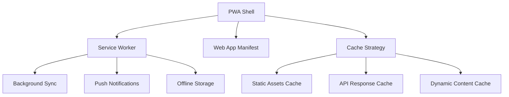
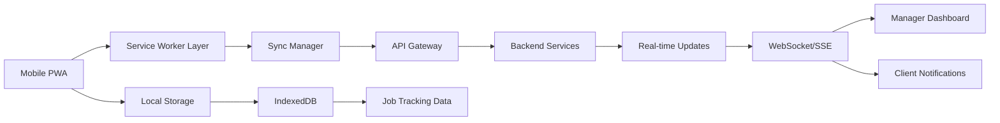

# Design Document

## Overview

The PWA Cleaning Tracker feature will transform the existing Maid4Maid React application into a Progressive Web App with enhanced mobile capabilities. The design focuses on providing cleaning staff with a native-like mobile experience for tracking job progress, while maintaining real-time synchronization with the existing web platform for managers and clients.

## Architecture

### PWA Core Components



### Application Architecture



## Components and Interfaces

### 1. PWA Configuration

**Web App Manifest (`public/manifest.json`)**

- App name, icons, theme colors
- Display mode: standalone
- Start URL and scope configuration
- Orientation: portrait for mobile optimization

**Service Worker (`public/sw.js`)**

- Cache-first strategy for static assets
- Network-first strategy for API calls
- Background sync for offline actions
- Push notification handling

### 2. Job Tracking Components

**JobTracker Component**

```typescript
interface JobTrackerProps {
  job: Job;
  onStartCleaning: (jobId: string) => Promise<void>;
  onEndCleaning: (jobId: string, notes?: string) => Promise<void>;
  isOffline: boolean;
}
```

**CleaningSession Component**

- Real-time timer display
- Progress indicators
- Quick action buttons
- Completion form with notes

**MobileJobList Component**

- Touch-optimized job cards
- Status indicators
- Swipe actions for quick access
- Pull-to-refresh functionality

### 3. Offline Management

**SyncManager Service**

```typescript
interface SyncManager {
  queueAction(action: OfflineAction): void;
  syncPendingActions(): Promise<void>;
  getOfflineStatus(): boolean;
}

interface OfflineAction {
  id: string;
  type: 'START_CLEANING' | 'END_CLEANING';
  jobId: string;
  timestamp: Date;
  data: any;
}
```

**LocalStorageService**

- Job data caching
- Offline action queue
- User session persistence
- Sync status tracking

### 4. Real-time Communication

**NotificationService**

```typescript
interface NotificationService {
  requestPermission(): Promise<boolean>;
  sendJobStartNotification(job: Job): void;
  sendJobCompleteNotification(job: Job, duration: number): void;
  subscribeToUpdates(userId: string): void;
}
```

**WebSocketManager**

- Real-time job status updates
- Manager dashboard synchronization
- Client notification triggers
- Connection state management

## Data Models

### Enhanced Job Model

```typescript
interface Job {
  id: string;
  clientId: string;
  teamId: string;
  assignedUserId: string;
  scheduledDate: Date;
  estimatedDuration: number;
  status: JobStatus;
  trackingData?: JobTrackingData;
  address: Address;
  client: Client;
}

interface JobTrackingData {
  startTime?: Date;
  endTime?: Date;
  actualDuration?: number;
  completionNotes?: string;
  isTrackedOffline: boolean;
  syncStatus: 'synced' | 'pending' | 'failed';
}

type JobStatus = 'scheduled' | 'in_progress' | 'completed' | 'cancelled';
```

### Offline Action Queue

```typescript
interface OfflineActionQueue {
  actions: OfflineAction[];
  lastSyncAttempt: Date;
  syncInProgress: boolean;
}
```

## Error Handling

### Offline Scenarios

- **Network Loss During Job Tracking**: Continue tracking locally, sync when online
- **Failed Sync Attempts**: Retry with exponential backoff, user notification
- **Conflicting Updates**: Last-write-wins with user confirmation for conflicts

### PWA Installation Issues

- **Browser Compatibility**: Graceful degradation for unsupported browsers
- **Installation Prompts**: Respect user preferences, don't spam prompts
- **Update Failures**: Fallback to cached version, notify user of issues

### Real-time Communication Failures

- **WebSocket Disconnection**: Automatic reconnection with backoff
- **Push Notification Failures**: Fallback to in-app notifications
- **Sync Conflicts**: Merge strategies with user resolution options

## Testing Strategy

### PWA Compliance Testing

- Lighthouse PWA audit (target score: 90+)
- Cross-browser compatibility testing
- Offline functionality verification
- Installation flow testing

### Mobile Experience Testing

- Touch interaction testing
- Performance on low-end devices
- Battery usage optimization
- Network condition simulation (3G, offline)

### Integration Testing

- Real-time synchronization accuracy
- Offline-to-online data consistency
- Multi-user concurrent job tracking
- Notification delivery verification

### User Acceptance Testing

- Staff workflow efficiency
- Manager dashboard real-time updates
- Client notification preferences
- Installation and onboarding flow

## Implementation Phases

### Phase 1: PWA Foundation

- Service worker implementation
- Web app manifest configuration
- Basic offline caching
- Installation prompts

### Phase 2: Job Tracking Core

- Start/end cleaning functionality
- Local data persistence
- Basic sync mechanism
- Mobile-optimized UI

### Phase 3: Real-time Features

- WebSocket integration
- Push notifications
- Manager dashboard updates
- Client notifications

### Phase 4: Advanced Offline Support

- Conflict resolution
- Advanced sync strategies
- Background sync
- Performance optimization

## Security Considerations

### Data Protection

- Encrypt sensitive data in local storage
- Secure WebSocket connections (WSS)
- Token-based authentication for API calls
- HTTPS enforcement for PWA features

### Offline Data Security

- Local data encryption
- Secure sync protocols
- User session validation
- Data purging on logout

## Performance Optimization

### Caching Strategy

- **Static Assets**: Cache-first with versioning
- **API Responses**: Stale-while-revalidate for job data
- **Images**: Cache with size optimization
- **Critical Resources**: Preload and cache

### Bundle Optimization

- Code splitting for PWA features
- Lazy loading for non-critical components
- Service worker optimization
- Asset compression and minification

### Mobile Performance

- Touch response optimization (<100ms)
- Smooth animations (60fps)
- Memory usage monitoring
- Battery usage optimization
