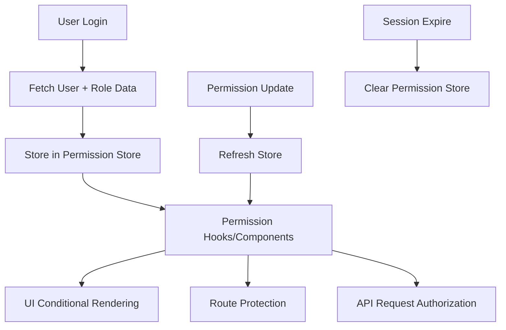
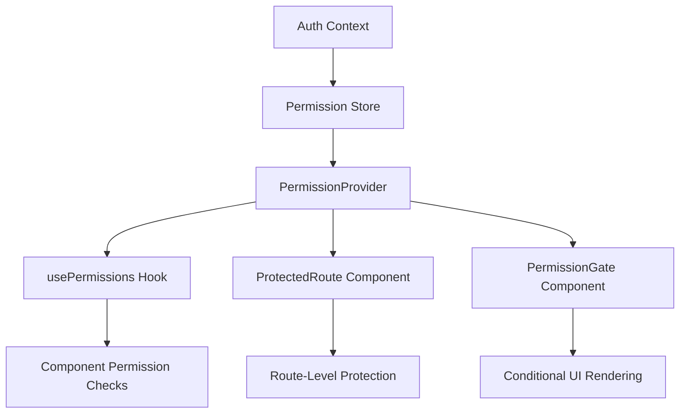

# Design Document

## Overview

The Role-Based Permissions system will be implemented as a comprehensive frontend authorization layer that integrates with the existing Zustand state management and React Query setup. The system will provide declarative permission checking through React hooks, higher-order components, and utility functions while maintaining type safety with TypeScript.

## Architecture

### Permission Data Flow



### State Management Architecture

The permission system will extend the existing Zustand store pattern with a dedicated permission store that integrates with the user authentication flow.

### Component Architecture



## Components and Interfaces

### Core Types and Interfaces

```typescript
// Permission-related types
interface Permission {
  resource: string;
  action: string;
  conditions?: Record<string, any>;
}

interface Role {
  id: string;
  name: string;
  slug: string;
  permissions: Permission[];
  isSystem: boolean;
  organizationId?: string;
}

interface UserPermissions {
  role: Role;
  permissions: Permission[];
  organizationId: string;
  userId: string;
}

// Permission check types
type PermissionKey = string;
type PermissionCheck = PermissionKey | PermissionKey[];
type PermissionLogic = 'AND' | 'OR';

interface PermissionCheckOptions {
  logic?: PermissionLogic;
  organizationId?: string;
  resourceId?: string;
}
```

### Permission Store (Zustand)

```typescript
interface PermissionStore {
  // State
  userPermissions: UserPermissions | null;
  isLoading: boolean;
  error: string | null;

  // Actions
  setPermissions: (permissions: UserPermissions) => void;
  clearPermissions: () => void;
  refreshPermissions: () => Promise<void>;

  // Selectors
  hasPermission: (
    check: PermissionCheck,
    options?: PermissionCheckOptions,
  ) => boolean;
  hasAnyPermission: (permissions: PermissionKey[]) => boolean;
  hasAllPermissions: (permissions: PermissionKey[]) => boolean;
  getUserRole: () => Role | null;
  isAdmin: () => boolean;
  isManager: () => boolean;
  isStaff: () => boolean;
}
```

### Permission Hooks

```typescript
// Main permission hook
function usePermissions() {
  return {
    hasPermission: (check: PermissionCheck, options?: PermissionCheckOptions) => boolean;
    hasAnyPermission: (permissions: PermissionKey[]) => boolean;
    hasAllPermissions: (permissions: PermissionKey[]) => boolean;
    userRole: Role | null;
    isLoading: boolean;
    error: string | null;
    isAdmin: boolean;
    isManager: boolean;
    isStaff: boolean;
  };
}

// Specific permission hooks for common checks
function useCanManageClients(): boolean;
function useCanScheduleJobs(): boolean;
function useCanManageTeams(): boolean;
function useCanViewReports(): boolean;
function useCanManageUsers(): boolean;
```

### Permission Components

```typescript
// Route protection component
interface ProtectedRouteProps {
  children: React.ReactNode;
  requiredPermissions: PermissionCheck;
  fallback?: React.ReactNode;
  redirectTo?: string;
  logic?: PermissionLogic;
}

// Conditional rendering component
interface PermissionGateProps {
  children: React.ReactNode;
  requiredPermissions: PermissionCheck;
  fallback?: React.ReactNode;
  logic?: PermissionLogic;
  showFallback?: boolean;
}

// Higher-order component for permission wrapping
function withPermissions<T>(
  Component: React.ComponentType<T>,
  requiredPermissions: PermissionCheck,
  options?: PermissionCheckOptions,
): React.ComponentType<T>;
```

## Data Models

### Permission Structure

The system will work with a standardized permission structure that maps to the backend JSON permissions:

```typescript
// Standard permission format
const PERMISSIONS = {
  // Client management
  'clients.view': 'View client information',
  'clients.create': 'Create new clients',
  'clients.edit': 'Edit client information',
  'clients.delete': 'Delete clients',

  // Job management
  'jobs.view': 'View job schedules',
  'jobs.create': 'Create new jobs',
  'jobs.edit': 'Edit job details',
  'jobs.delete': 'Delete jobs',
  'jobs.assign': 'Assign jobs to teams',

  // Team management
  'teams.view': 'View team information',
  'teams.create': 'Create new teams',
  'teams.edit': 'Edit team details',
  'teams.delete': 'Delete teams',
  'teams.manage_members': 'Manage team members',

  // User management
  'users.view': 'View user profiles',
  'users.create': 'Create new users',
  'users.edit': 'Edit user information',
  'users.delete': 'Delete users',
  'users.manage_roles': 'Manage user roles',

  // Reports and analytics
  'reports.view': 'View reports and analytics',
  'reports.export': 'Export report data',

  // Organization management
  'organization.settings': 'Manage organization settings',
  'organization.billing': 'Access billing information',
} as const;

type PermissionKey = keyof typeof PERMISSIONS;
```

### Role Hierarchy

```typescript
const ROLE_HIERARCHY = {
  ADMIN: {
    level: 3,
    inherits: ['MANAGER', 'STAFF'],
    permissions: Object.keys(PERMISSIONS),
  },
  MANAGER: {
    level: 2,
    inherits: ['STAFF'],
    permissions: [
      'clients.view',
      'clients.create',
      'clients.edit',
      'jobs.view',
      'jobs.create',
      'jobs.edit',
      'jobs.assign',
      'teams.view',
      'teams.manage_members',
      'users.view',
      'reports.view',
    ],
  },
  STAFF: {
    level: 1,
    inherits: [],
    permissions: ['clients.view', 'jobs.view', 'jobs.edit', 'teams.view'],
  },
} as const;
```

## Error Handling

### Permission Error Types

```typescript
enum PermissionErrorType {
  INSUFFICIENT_PERMISSIONS = 'INSUFFICIENT_PERMISSIONS',
  PERMISSION_LOADING = 'PERMISSION_LOADING',
  PERMISSION_NOT_FOUND = 'PERMISSION_NOT_FOUND',
  ORGANIZATION_MISMATCH = 'ORGANIZATION_MISMATCH',
  ROLE_NOT_FOUND = 'ROLE_NOT_FOUND',
}

interface PermissionError {
  type: PermissionErrorType;
  message: string;
  requiredPermissions?: PermissionKey[];
  userPermissions?: PermissionKey[];
}
```

### Error Handling Strategy

1. **Graceful Degradation**: When permissions are loading, show loading states instead of hiding content
2. **Clear Messaging**: Provide specific error messages explaining what permissions are needed
3. **Fallback Content**: Offer alternative actions or information when access is denied
4. **Logging**: Log permission errors for debugging and security monitoring
5. **Recovery**: Provide mechanisms to refresh permissions or contact administrators

## Testing Strategy

### Unit Testing

```typescript
// Permission store tests
describe('PermissionStore', () => {
  test('should check single permission correctly');
  test('should check multiple permissions with AND logic');
  test('should check multiple permissions with OR logic');
  test('should handle role hierarchy correctly');
  test('should clear permissions on logout');
});

// Permission hooks tests
describe('usePermissions', () => {
  test('should return correct permission status');
  test('should handle loading states');
  test('should handle error states');
});

// Permission components tests
describe('PermissionGate', () => {
  test('should render children when permissions are met');
  test('should render fallback when permissions are not met');
  test('should handle loading states');
});
```

### Integration Testing

```typescript
// Route protection tests
describe('ProtectedRoute', () => {
  test('should allow access with correct permissions');
  test('should redirect when permissions are insufficient');
  test('should handle permission loading states');
});

// API integration tests
describe('Permission API Integration', () => {
  test('should fetch and store permissions on login');
  test('should handle permission refresh');
  test('should handle API errors gracefully');
});
```

### E2E Testing

```typescript
// User journey tests
describe('Permission User Journeys', () => {
  test('Admin user can access all features');
  test('Manager user has limited access');
  test('Staff user has restricted access');
  test('Permission changes reflect immediately in UI');
});
```

## Implementation Phases

### Phase 1: Core Permission Infrastructure

- Create permission store and types
- Implement basic permission checking logic
- Create usePermissions hook
- Add permission loading to auth flow

### Phase 2: UI Integration

- Implement PermissionGate component
- Create ProtectedRoute component
- Add permission checks to existing components
- Implement error handling and fallbacks

### Phase 3: Feature Integration

- Integrate with dashboard components
- Add permissions to client management
- Implement job scheduling permissions
- Add team management permissions

### Phase 4: Advanced Features

- Implement role hierarchy logic
- Add organization-scoped permissions
- Create permission management UI
- Add comprehensive error handling

## Security Considerations

1. **Client-Side Validation**: All permission checks are for UX only; server-side validation is required
2. **Token Security**: Permission data should be tied to secure authentication tokens
3. **Permission Refresh**: Implement mechanisms to refresh permissions when roles change
4. **Audit Logging**: Log permission checks and failures for security monitoring
5. **Default Deny**: Always default to denying access when permission status is unclear
6. **Organization Isolation**: Ensure permissions are properly scoped to user's organization

## Performance Considerations

1. **Caching**: Cache permission checks to avoid repeated calculations
2. **Lazy Loading**: Load permission data only when needed
3. **Memoization**: Memoize permission check results in React components
4. **Bundle Size**: Keep permission logic lightweight to minimize bundle impact
5. **Render Optimization**: Minimize re-renders when permission state changes
