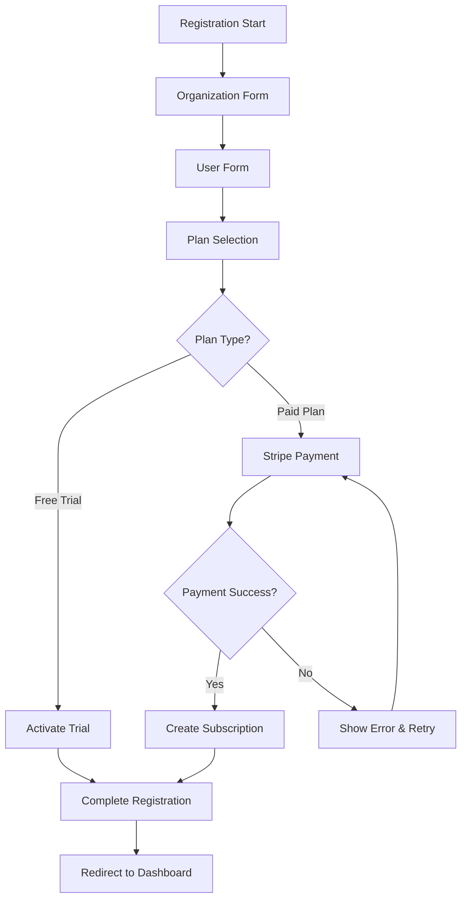

# Design Document

## Overview

The Stripe Subscription feature extends the existing registration flow to include comprehensive subscription management with Stripe integration. The design builds upon the current three-step registration process (Organization → User → Plan) by enhancing the third step with actual subscription functionality, including plan selection, free trial activation, and Stripe payment processing.

The implementation focuses on frontend integration with Stripe Elements for secure payment processing, while maintaining the existing patterns for form validation, state management, and user experience consistency.

## Architecture

### High-Level Flow



### Component Architecture

The feature follows the existing registration pattern with enhanced plan selection:

- **Enhanced Registration Page**: Extends current registration with subscription logic
- **Plan Selection Component**: New component for displaying and selecting subscription plans
- **Stripe Payment Component**: Secure payment form using Stripe Elements
- **Subscription Service**: API integration for subscription management
- **Enhanced Form Schemas**: Extended validation for subscription data

## Components and Interfaces

### Core Components

#### 1. Enhanced RegisterPage Component

- Extends existing `src/pages/register/index.tsx`
- Manages subscription state and Stripe integration
- Handles plan selection and payment flow coordination

#### 2. PlanSelectionForm Component

- New component: `src/pages/register/plan-selection-form.tsx`
- Displays available subscription plans with pricing
- Handles plan selection and free trial activation
- Integrates with Stripe for payment processing

#### 3. StripePaymentForm Component

- New component: `src/pages/register/stripe-payment-form.tsx`
- Secure payment form using Stripe Elements
- Handles payment method collection and processing
- Manages payment errors and success states

#### 4. PlanCard Component

- New component: `src/pages/register/plan-card.tsx`
- Reusable component for displaying individual plans
- Shows features, pricing, and selection state
- Supports free trial and paid plan variants

### Enhanced Existing Components

#### StepsIndicator

- Update to reflect subscription-aware step names
- Maintain existing visual design and accessibility

#### Form Schemas

- Extend `src/schemas/register.types.ts` with subscription schemas
- Add plan selection and payment validation

### New Service Layer

#### SubscriptionService

- New service: `src/services/subscription.service.ts`
- Handles plan fetching, subscription creation, and trial activation
- Integrates with backend subscription endpoints

#### StripeService

- New service: `src/services/stripe.service.ts`
- Manages Stripe client-side integration
- Handles payment intent creation and confirmation

## Data Models

### Subscription Plan Model

```typescript
interface SubscriptionPlan {
  id: string;
  name: string;
  description: string;
  price: number;
  currency: string;
  interval: 'month' | 'year';
  features: string[];
  limitations: {
    users?: number;
    teams?: number;
    jobs?: number;
  };
  stripeProductId: string;
  stripePriceId: string;
  isPopular?: boolean;
  trialDays?: number;
}
```

### Subscription Model

```typescript
interface Subscription {
  id: string;
  planId: string;
  status: 'active' | 'trialing' | 'past_due' | 'canceled' | 'incomplete';
  currentPeriodStart: Date;
  currentPeriodEnd: Date;
  trialStart?: Date;
  trialEnd?: Date;
  stripeSubscriptionId: string;
  stripeCustomerId: string;
}
```

### Enhanced Registration Form Schema

```typescript
const subscriptionFormSchema = z.object({
  organization: registrationOrgSchema,
  userMaster: registrationUserSchema,
  subscription: z.object({
    planId: z.string(),
    paymentMethodId: z.string().optional(),
    isFreeTrial: z.boolean(),
  }),
});
```

### Payment Intent Model

```typescript
interface PaymentIntent {
  id: string;
  clientSecret: string;
  amount: number;
  currency: string;
  status: string;
}
```

## Error Handling

### Stripe Integration Errors

1. **Payment Failures**

   - Card declined, insufficient funds, etc.
   - Display user-friendly error messages
   - Allow retry with same or different payment method

2. **Network Errors**

   - Connection issues during payment processing
   - Implement retry logic with exponential backoff
   - Provide clear feedback and manual retry options

3. **Validation Errors**
   - Invalid payment method details
   - Real-time validation feedback
   - Prevent form submission until resolved

### Subscription Management Errors

1. **Plan Loading Failures**

   - Fallback to cached plans or default options
   - Retry mechanism with user notification
   - Graceful degradation to basic registration

2. **Subscription Creation Failures**
   - Rollback payment if subscription creation fails
   - Clear error messaging with support contact
   - Preserve user data for retry attempts

### Form Validation Errors

1. **Step Validation**

   - Prevent progression with invalid data
   - Clear field-level error messages
   - Maintain form state during navigation

2. **Cross-Step Validation**
   - Validate complete form before final submission
   - Handle dependencies between steps
   - Provide summary of validation issues

## Testing Strategy

### Unit Testing

1. **Component Testing**

   - Plan selection logic and UI states
   - Form validation and error handling
   - Stripe Elements integration mocking

2. **Service Testing**

   - API integration with mocked responses
   - Error handling and retry logic
   - Data transformation and validation

3. **Schema Testing**
   - Validation rules for all form steps
   - Edge cases and boundary conditions
   - Type safety verification

### Integration Testing

1. **Registration Flow Testing**

   - Complete end-to-end registration process
   - Step navigation and data persistence
   - Error recovery and retry scenarios

2. **Stripe Integration Testing**

   - Payment processing with test cards
   - Webhook handling simulation
   - Error scenarios and edge cases

3. **API Integration Testing**
   - Subscription creation and management
   - Plan fetching and caching
   - Authentication and authorization

### Accessibility Testing

1. **Keyboard Navigation**

   - Tab order through all form elements
   - Stripe Elements keyboard accessibility
   - Focus management during step transitions

2. **Screen Reader Support**

   - ARIA labels for all interactive elements
   - Error announcements and status updates
   - Plan comparison table accessibility

3. **Visual Accessibility**
   - Color contrast compliance
   - Text scaling and responsive design
   - High contrast mode support

## Security Considerations

### Payment Security

1. **PCI Compliance**

   - Use Stripe Elements for secure card data handling
   - Never store sensitive payment information
   - Implement proper CSP headers

2. **Data Protection**
   - Encrypt sensitive user data in transit
   - Secure API endpoints with proper authentication
   - Implement rate limiting for payment attempts

### Authentication Security

1. **Registration Security**

   - Strong password requirements
   - Email verification for account activation
   - Protection against automated registration

2. **Session Management**
   - Secure token handling
   - Proper session expiration
   - CSRF protection for form submissions

## Performance Considerations

### Loading Optimization

1. **Stripe Elements Loading**

   - Lazy load Stripe SDK when needed
   - Preload payment form for selected paid plans
   - Optimize bundle size with dynamic imports

2. **Plan Data Caching**
   - Cache subscription plans in local storage
   - Implement stale-while-revalidate pattern
   - Minimize API calls during plan selection

### User Experience Optimization

1. **Progressive Enhancement**

   - Basic functionality without JavaScript
   - Enhanced experience with full feature set
   - Graceful degradation for older browsers

2. **Loading States**
   - Skeleton loading for plan cards
   - Progress indicators for payment processing
   - Optimistic UI updates where appropriate

## Internationalization

### Multi-language Support

1. **Plan Information**

   - Localized plan names and descriptions
   - Currency formatting based on locale
   - Feature lists in user's language

2. **Error Messages**

   - Localized Stripe error messages
   - Consistent error messaging patterns
   - Cultural considerations for payment flows

3. **Legal and Compliance**
   - Terms of service and privacy policy links
   - Region-specific compliance requirements
   - Localized payment method preferences
