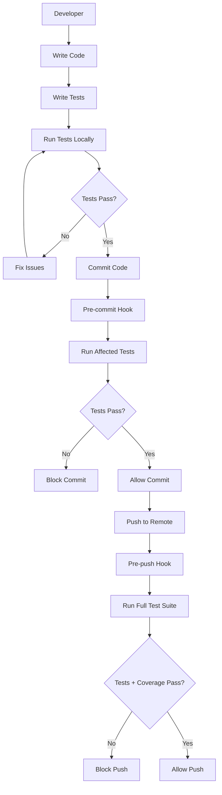

# Vitest & React Testing Library Implementation Design

## Overview

This design document outlines the comprehensive testing infrastructure implementation for the Maid4Maid application using Vitest and React Testing Library. The solution provides a robust testing foundation with unit tests, component tests, integration tests, coverage reporting, and automated quality gates. The implementation follows testing best practices while integrating seamlessly with the existing development workflow and MSW mocking infrastructure.

## Architecture

### Testing Infrastructure Components

```
src/
├── test/
│   ├── setup.ts                    # Global test setup and configuration
│   ├── utils/
│   │   ├── test-utils.tsx          # RTL custom render and providers
│   │   ├── mock-utils.ts           # Mock data and utilities
│   │   ├── auth-utils.ts           # Authentication testing helpers
│   │   └── api-utils.ts            # API testing utilities
│   └── fixtures/
│       ├── user.fixtures.ts        # Test data fixtures
│       ├── client.fixtures.ts
│       ├── job.fixtures.ts
│       └── index.ts
├── components/
│   └── **/__tests__/               # Component tests co-located
│       ├── Component.test.tsx
│       └── Component.integration.test.tsx
├── hooks/
│   └── **/__tests__/               # Hook tests
│       └── useHook.test.ts
├── services/
│   └── **/__tests__/               # Service tests
│       └── service.test.ts
├── utils/
│   └── **/__tests__/               # Utility tests
│       └── utils.test.ts
└── pages/
    └── **/__tests__/               # Page integration tests
        └── Page.test.tsx

# Configuration Files
├── vitest.config.ts                # Vitest configuration
├── .husky/
│   ├── pre-commit                  # Pre-commit test hooks
│   └── pre-push                    # Pre-push test hooks
└── coverage/                       # Coverage reports (gitignored)
```

### Integration Architecture



## Components and Interfaces

### Test Utilities Structure

```typescript
// test/utils/test-utils.tsx
import { ReactElement } from 'react'
import { render, RenderOptions } from '@testing-library/react'
import { QueryClient, QueryClientProvider } from '@tanstack/react-query'
import { BrowserRouter } from 'react-router-dom'
import { ThemeProvider } from '@/contexts/theme-context'
import { AuthProvider } from '@/contexts/auth-context'

interface CustomRenderOptions extends Omit<RenderOptions, 'wrapper'> {
  initialEntries?: string[]
  queryClient?: QueryClient
  authenticated?: boolean
  userRole?: string
}

const createTestQueryClient = () => new QueryClient({
  defaultOptions: {
    queries: { retry: false },
    mutations: { retry: false }
  }
})

export const renderWithProviders = (
  ui: ReactElement,
  options: CustomRenderOptions = {}
) => {
  const {
    initialEntries = ['/'],
    queryClient = createTestQueryClient(),
    authenticated = false,
    userRole = 'admin',
    ...renderOptions
  } = options

  const Wrapper = ({ children }: { children: React.ReactNode }) => (
    <BrowserRouter>
      <QueryClientProvider client={queryClient}>
        <ThemeProvider>
          <AuthProvider initialAuth={authenticated ? { role: userRole } : null}>
            {children}
          </AuthProvider>
        </ThemeProvider>
      </QueryClientProvider>
    </BrowserRouter>
  )

  return render(ui, { wrapper: Wrapper, ...renderOptions })
}

// Re-export everything from RTL
export * from '@testing-library/react'
export { renderWithProviders as render }
```

### Mock Utilities

```typescript
// test/utils/mock-utils.ts
import { vi } from 'vitest';
import { server } from '@/mocks/server';
import { http, HttpResponse } from 'msw';

export const mockApiResponse = <T>(
  method: 'get' | 'post' | 'put' | 'delete',
  url: string,
  response: T,
  status: number = 200,
) => {
  server.use(http[method](url, () => HttpResponse.json(response, { status })));
};

export const mockApiError = (
  method: 'get' | 'post' | 'put' | 'delete',
  url: string,
  status: number = 500,
  message: string = 'Internal Server Error',
) => {
  server.use(
    http[method](url, () => HttpResponse.json({ error: message }, { status })),
  );
};

export const mockConsoleError = () => {
  const consoleSpy = vi.spyOn(console, 'error').mockImplementation(() => {});
  return consoleSpy;
};

export const mockLocalStorage = () => {
  const localStorageMock = {
    getItem: vi.fn(),
    setItem: vi.fn(),
    removeItem: vi.fn(),
    clear: vi.fn(),
  };

  Object.defineProperty(window, 'localStorage', {
    value: localStorageMock,
  });

  return localStorageMock;
};
```

### Authentication Test Utilities

```typescript
// test/utils/auth-utils.ts
import { User } from '@/schemas/user.types';
import { createMockUser } from '@/mocks/data/user.data';

export const createAuthenticatedUser = (overrides?: Partial<User>) => {
  return createMockUser({
    role: 'admin',
    ...overrides,
  });
};

export const mockAuthToken = (user: User) => {
  const token = `mock-token-${user.id}`;
  localStorage.setItem('auth-token', token);
  return token;
};

export const clearAuthMocks = () => {
  localStorage.removeItem('auth-token');
};
```

## Data Models

### Test Fixtures Structure

```typescript
// test/fixtures/user.fixtures.ts
import { User, CreateUserRequest } from '@/schemas/user.types';

export const userFixtures = {
  admin: {
    id: '1',
    name: 'Admin User',
    email: 'admin@test.com',
    role: 'admin',
    organizationId: 'org-1',
  } as User,

  manager: {
    id: '2',
    name: 'Manager User',
    email: 'manager@test.com',
    role: 'manager',
    organizationId: 'org-1',
  } as User,

  staff: {
    id: '3',
    name: 'Staff User',
    email: 'staff@test.com',
    role: 'staff',
    organizationId: 'org-1',
  } as User,

  createUserRequest: {
    name: 'New User',
    email: 'new@test.com',
    role: 'staff',
    password: 'password123',
  } as CreateUserRequest,
};
```

### Test Data Management

```typescript
// test/fixtures/index.ts
export { userFixtures } from './user.fixtures';
export { clientFixtures } from './client.fixtures';
export { jobFixtures } from './job.fixtures';
export { teamFixtures } from './team.fixtures';

// Centralized test data reset
export const resetAllFixtures = () => {
  // Reset any stateful test data
};
```

## Error Handling

### Test Error Patterns

```typescript
// Common test error scenarios
export const testErrorScenarios = {
  networkError: () =>
    mockApiError('get', '/api/v1/users', 500, 'Network Error'),

  validationError: (field: string) =>
    mockApiError(
      'post',
      '/api/v1/users',
      422,
      `Validation failed for ${field}`,
    ),

  authenticationError: () =>
    mockApiError('get', '/api/v1/users', 401, 'Unauthorized'),

  notFoundError: (resource: string) =>
    mockApiError('get', `/api/v1/${resource}`, 404, `${resource} not found`),
};
```

## Testing Strategy

### Component Testing Patterns

```typescript
// Example component test structure
describe('UserList Component', () => {
  beforeEach(() => {
    server.resetHandlers()
  })

  it('renders user list successfully', async () => {
    mockApiResponse('get', '/api/v1/users', {
      data: [userFixtures.admin, userFixtures.manager]
    })

    render(<UserList />, { authenticated: true })

    expect(await screen.findByText('Admin User')).toBeInTheDocument()
    expect(screen.getByText('Manager User')).toBeInTheDocument()
  })

  it('handles loading state', () => {
    render(<UserList />, { authenticated: true })
    expect(screen.getByTestId('loading-spinner')).toBeInTheDocument()
  })

  it('handles error state', async () => {
    testErrorScenarios.networkError()

    render(<UserList />, { authenticated: true })

    expect(await screen.findByText(/error loading users/i)).toBeInTheDocument()
  })

  it('handles user interactions', async () => {
    const user = userEvent.setup()
    mockApiResponse('get', '/api/v1/users', { data: [userFixtures.admin] })

    render(<UserList />, { authenticated: true })

    const editButton = await screen.findByRole('button', { name: /edit/i })
    await user.click(editButton)

    expect(screen.getByRole('dialog')).toBeInTheDocument()
  })
})
```

### Service Testing Patterns

```typescript
// Example service test
describe('UserService', () => {
  it('fetches users successfully', async () => {
    mockApiResponse('get', '/api/v1/users', {
      data: [userFixtures.admin],
    });

    const result = await userService.getUsers();

    expect(result.data).toHaveLength(1);
    expect(result.data[0]).toEqual(userFixtures.admin);
  });

  it('handles API errors', async () => {
    testErrorScenarios.networkError();

    await expect(userService.getUsers()).rejects.toThrow('Network Error');
  });
});
```

### Integration Testing Patterns

```typescript
// Example integration test
describe('User Management Flow', () => {
  it('completes full user creation workflow', async () => {
    const user = userEvent.setup()

    // Mock successful API responses
    mockApiResponse('post', '/api/v1/users', { data: userFixtures.admin })
    mockApiResponse('get', '/api/v1/users', { data: [userFixtures.admin] })

    render(<UserManagementPage />, { authenticated: true, userRole: 'admin' })

    // Click create user button
    await user.click(screen.getByRole('button', { name: /create user/i }))

    // Fill form
    await user.type(screen.getByLabelText(/name/i), 'New User')
    await user.type(screen.getByLabelText(/email/i), 'new@test.com')
    await user.selectOptions(screen.getByLabelText(/role/i), 'staff')

    // Submit form
    await user.click(screen.getByRole('button', { name: /save/i }))

    // Verify success
    expect(await screen.findByText(/user created successfully/i)).toBeInTheDocument()
    expect(screen.getByText('New User')).toBeInTheDocument()
  })
})
```

## Coverage Configuration

### Vitest Coverage Setup

```typescript
// vitest.config.ts
export default defineConfig({
  test: {
    globals: true,
    environment: 'jsdom',
    setupFiles: ['./src/test/setup.ts'],
    coverage: {
      provider: 'v8',
      reporter: ['text', 'json', 'html'],
      exclude: [
        'node_modules/',
        'src/test/',
        '**/*.d.ts',
        '**/*.config.*',
        '**/coverage/**',
        'src/main.tsx',
        'src/vite-env.d.ts',
      ],
      thresholds: {
        global: {
          branches: 80,
          functions: 80,
          lines: 80,
          statements: 80,
        },
      },
    },
  },
});
```

### Husky Integration

```bash
# .husky/pre-commit
#!/usr/bin/env sh
. "$(dirname -- "$0")/_/husky.sh"

# Run linting
npm run lint

# Run tests for staged files
npm run test:staged

# .husky/pre-push
#!/usr/bin/env sh
. "$(dirname -- "$0")/_/husky.sh"

# Run full test suite with coverage
npm run test:coverage
```

### Package.json Scripts

```json
{
  "scripts": {
    "test": "vitest",
    "test:ui": "vitest --ui",
    "test:run": "vitest run",
    "test:coverage": "vitest run --coverage",
    "test:staged": "vitest related --run",
    "test:watch": "vitest --watch"
  }
}
```

This design provides a comprehensive testing infrastructure that ensures code quality, prevents regressions, and maintains high development standards while integrating seamlessly with the existing project structure and MSW mocking capabilities.
